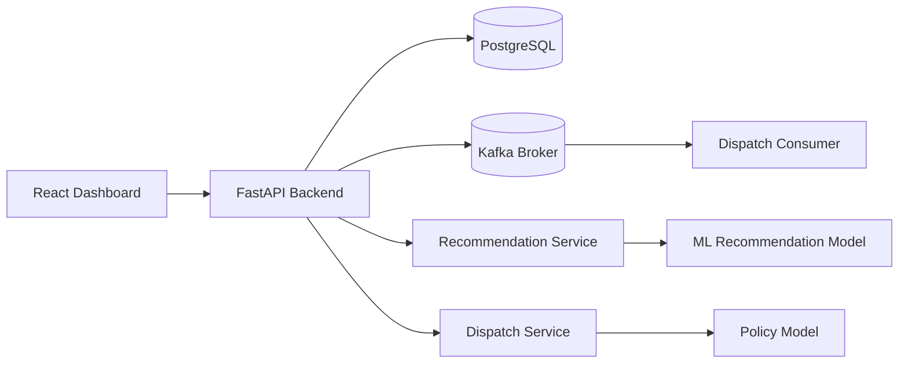
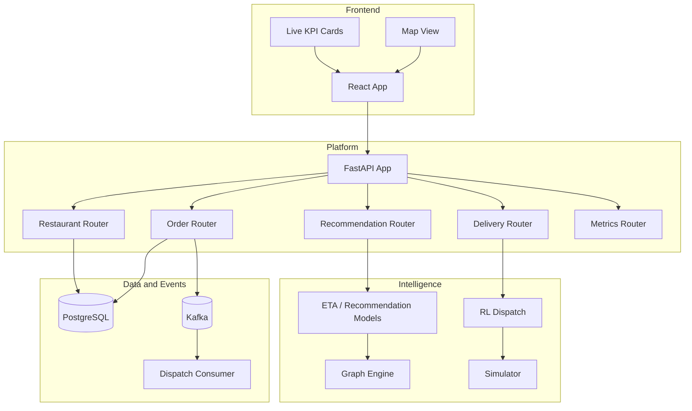
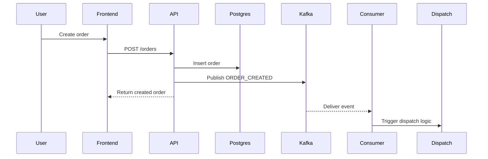

# AI Food Logistics System

[](https://github.com/maverick0721/AI-Food-Logistics-System/actions/workflows/ci.yml)
[](https://www.python.org/)
[](https://fastapi.tiangolo.com/)
[](https://react.dev/)
[](https://kafka.apache.org/)
[](https://www.postgresql.org/)

An end-to-end experimentation platform for intelligent food delivery operations. The repository combines a FastAPI backend, Kafka-based event flow, PostgreSQL persistence, a React dashboard, and a set of ML and simulation modules for routing, ETA prediction, demand modeling, and dispatch experimentation.

The goal of the project is straightforward: make it easy to model, run, and improve a food logistics system without splitting the work across multiple disconnected repositories.

## Quick Start

### One-Command Interview Demo (Recommended)

From a fresh clone, run one command:

```bash
./scripts/bootstrap_and_start.sh
```

This command will:

- install missing system dependencies (Ubuntu/Debian via apt)
- create `.venv` and install Python packages
- download and configure local Kafka binaries (if missing)
- start PostgreSQL and initialize `food_app` / `food_delivery_ai`
- start Kafka, ZooKeeper, FastAPI, dispatch consumer, and React frontend

To stop everything:

```bash
./scripts/stop_demo.sh
```

If you want the shortest path to a working local system, this is it:

```bash
git clone https://github.com/maverick0721/AI-Food-Logistics-System.git
cd AI-Food-Logistics-System
python3 -m venv .venv
source .venv/bin/activate
pip install -e .
pip install -m requirements.txt

./scripts/start_full_system.sh

cd frontend
npm install
npm start
```

Then open:

- Backend API docs: `http://127.0.0.1:8000/docs`
- Frontend dashboard: `http://127.0.0.1:3000`

To stop backend services when you are done:

```bash
./scripts/stop_full_system.sh
```

## What This Repository Covers

- Order intake and restaurant management through a FastAPI backend
- Kafka event publishing and consumption for order-driven workflows
- PostgreSQL-backed persistence for operational entities
- A React dashboard for monitoring, order creation, recommendation checks, and map-based awareness
- Research modules for graph routing, ETA prediction, demand forecasting, RL dispatch, and simulation
- CI checks for backend tests, import integrity, frontend tests, and frontend production builds

## Feature Snapshot

| Area | What it does | Current role in the repo |
| --- | --- | --- |
| FastAPI backend | Exposes operational APIs for orders, restaurants, dispatch, recommendation, and metrics | Core runtime service |
| Kafka streaming | Publishes and consumes order events | Event-driven workflow backbone |
| PostgreSQL | Stores operational entities | Primary persistence layer |
| React dashboard | Provides an operator-facing control surface | Local UI and monitoring console |
| Graph engine | Supports routing and graph-aware modeling | Research and optimization module |
| RL dispatch | Learns or evaluates dispatch strategies | Decision experimentation |
| Simulation layer | Generates large-scale operating scenarios | Training and benchmarking support |
| CI workflow | Tests backend, imports, and frontend build stability | Quality guardrail |

## System At A Glance



## Architecture

The backend is the operational core. It exposes endpoints for orders, restaurants, dispatch, recommendation, and dashboard metrics. Order creation writes to PostgreSQL and publishes an `ORDER_CREATED` event to Kafka. A consumer listens to that stream and can trigger downstream dispatch-oriented workflows. Around that operational path, the repository also contains simulation and learning modules used to train, benchmark, and iterate on logistics strategies.



## Core Runtime Workflow



## Repository Layout

```text
backend/          FastAPI application, routers, services, streaming logic, database models
frontend/         React dashboard and UI tests
graph_engine/     Routing, graph building, and graph learning modules
ml_models/        Recommendation, ETA, and forecasting model code
rl_dispatch/      Reinforcement learning environment and training code
mega_simulator/   Large-scale simulation components
training/         Shared policy model and training scripts
data_pipeline/    Dataset ingestion and processing
evaluation/       Evaluation scripts for model behavior
infra/            Docker, Kubernetes, Kafka helper scripts, monitoring config
scripts/          One-command local system startup and shutdown helpers
tests/            Backend smoke tests and config tests
docs/             Architecture notes
```

## Local Development

### 1. Environment Setup

```bash
git clone https://github.com/maverick0721/AI-Food-Logistics-System.git
cd AI-Food-Logistics-System
python3 -m venv .venv
source .venv/bin/activate
pip install -e .
pip install -r requirements.txt
```

If `requirements.txt` is intentionally lightweight in your environment, install only the packages you need for the path you are testing.

### 2. Start the Full Local Stack

The repository includes helper scripts for local development that start Kafka, ZooKeeper, PostgreSQL, FastAPI, and the dispatch consumer.

```bash
./scripts/start_full_system.sh
```

Available local endpoints after startup:

- API: `http://127.0.0.1:8000`
- API docs: `http://127.0.0.1:8000/docs`
- PostgreSQL: `127.0.0.1:5432`
- Kafka: `127.0.0.1:9092`

To stop everything:

```bash
./scripts/stop_full_system.sh
```

### 3. Start the Frontend

From the frontend directory:

```bash
cd frontend
npm install
npm start
```

The dashboard runs on port `3000` by default.

For Mapbox rendering, define a token in `frontend/.env`:

```bash
REACT_APP_MAPBOX_TOKEN=your_public_mapbox_token
```

## Frontend Experience

The frontend is designed as a lightweight operations console rather than a marketing site. It includes:

- A modern dashboard layout with a day/night theme toggle
- Live KPI cards backed by backend metrics
- Order creation and recommendation panels
- Restaurant list overview
- Delivery map panel with safe fallback behavior if the map cannot initialize

## Dashboard Preview

The dashboard is structured as an operations surface, not a landing page. It is designed to feel crisp and focused under real usage:

- a left navigation rail for quick section access
- live KPI cards backed by backend metrics
- a day/night theme switch for different viewing conditions
- a map-led top section for spatial context
- compact panels for orders, restaurants, and recommendation checks

If you want to publish the repository publicly, this section is the right place to add one or two screenshots of the running UI once you capture them locally.

## API Surface

Key endpoints currently exposed by the backend:

- `GET /`
- `GET /orders`
- `POST /orders`
- `GET /restaurants`
- `POST /restaurants`
- `GET /recommend?user_id=...&restaurant_id=...`
- `POST /dispatch/{order_id}`
- `GET /metrics/dashboard`

## Testing and Quality Checks

Backend:

```bash
pytest -q
```

Frontend tests:

```bash
cd frontend
CI=true npm test -- --watchAll=false --runInBand
```

Frontend production build:

```bash
cd frontend
npm run build
```

The CI workflow runs:

- Backend tests
- Backend syntax check
- Backend import sweep
- Frontend tests
- Frontend production build

## Infrastructure Notes

The repository includes Docker, Docker Compose, Kubernetes, and monitoring manifests under `infra/`, but whether those can be executed depends on the host environment.

For example, some remote notebook or sandbox environments do not expose a usable Docker daemon or Kubernetes tooling. In those cases, the shell scripts in `scripts/` are the intended local runtime path.

## Design Principles Behind The Repo

This codebase is opinionated in a useful way:

- Keep operational workflows runnable without heavy orchestration when possible
- Keep ML, simulation, and serving code close enough to evolve together
- Prefer clear local scripts for development before optimizing deployment paths
- Test the system at the seams: API, events, imports, and frontend build stability

## Why The Architecture Looks Like This

This repository is intentionally not split into separate backend, frontend, and research repositories. That tradeoff is deliberate.

Keeping the serving layer, event flow, simulator, and model code in one place makes iteration faster when the system is still evolving. If the dispatch policy changes, the API contract, consumer behavior, training loop, and dashboard usually need to evolve together. In practice, that coupling is easier to manage in one repository than across several loosely coordinated ones.

Kafka is used where asynchronous flow matters, not as decoration. The backend owns request-time operations, PostgreSQL owns state, and Kafka carries event-time transitions. That separation keeps the request path understandable while still allowing downstream consumers to react independently.

The local shell scripts also reflect a practical choice: development should remain possible even in environments where Docker or Kubernetes are unavailable. That is why the repo supports orchestration manifests under `infra/`, but still treats `scripts/start_full_system.sh` as a first-class development path.

## Roadmap-Friendly Areas

There are several natural directions for expansion:

- richer recommendation and ETA metrics
- real dispatch dashboards tied directly to stream state
- stronger simulator-to-model feedback loops
- deeper observability with Prometheus and runtime traces
- production deployment hardening for containerized environments

## Troubleshooting

### Frontend opens locally but not from your browser

If the React app works on the VM but not from your own browser, the most common issue is network reachability rather than application failure.

- `localhost:3000` only works on the machine running the frontend server
- private addresses such as `10.x.x.x` are usually internal-only
- if your environment blocks ingress on port `3000`, use port forwarding or an SSH tunnel

Useful checks:

```bash
curl -I http://127.0.0.1:3000
ss -ltnp | grep ':3000'
```

### Kafka broker does not start

The usual cause in constrained cloud environments is listener or hostname misconfiguration.

- prefer explicit localhost listeners
- verify ZooKeeper is already up before starting Kafka
- check `infra/kafka/kafka.log` and `infra/kafka/zookeeper.log`

Use:

```bash
./infra/kafka-start.sh
./infra/kafka-stop.sh
```

### FastAPI starts but dispatch fails

This usually points to model-loading or import-time issues in the dispatch path.

- confirm the policy model shape matches the saved checkpoint
- verify the backend can import `training.policy_model`
- check the FastAPI log if startup stalls

Useful checks:

```bash
pytest -q
python -m compileall -q backend training
tail -f logs/fastapi.log
```

### Docker Compose deployment

If your target environment provides a working Docker daemon and Compose plugin, the repository can be started with the compose definition under `infra/`.

```bash
docker compose -f infra/docker-compose.yml up --build
docker compose -f infra/docker-compose.yml down
```

### Kubernetes deployment

If you are deploying to a Kubernetes-capable environment, apply the manifests under `infra/kubernetes/`.

```bash
kubectl apply -f infra/kubernetes/
kubectl get pods
kubectl get services
```

### Hosted sandbox limitation

Some hosted notebook or sandbox environments do not expose a usable Docker daemon, Compose plugin, or Kubernetes runtime even when the configuration files are correct. In those environments, container commands may fail for infrastructure reasons rather than repository issues.

## License

Personal Usecase
